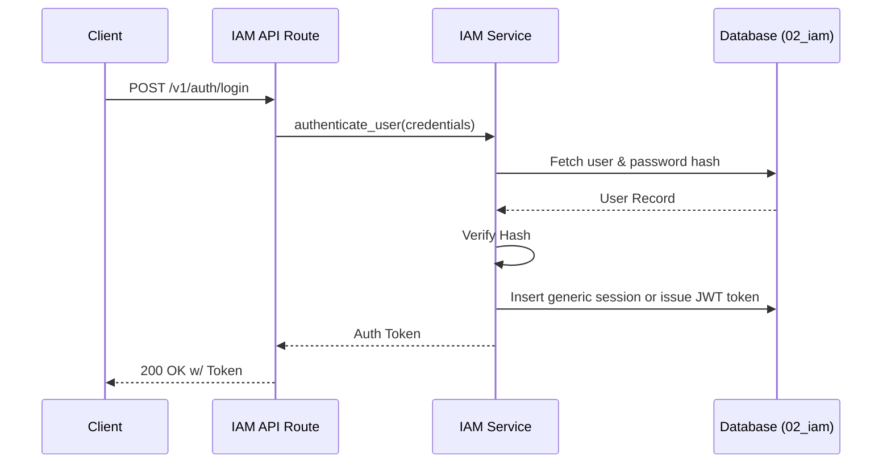
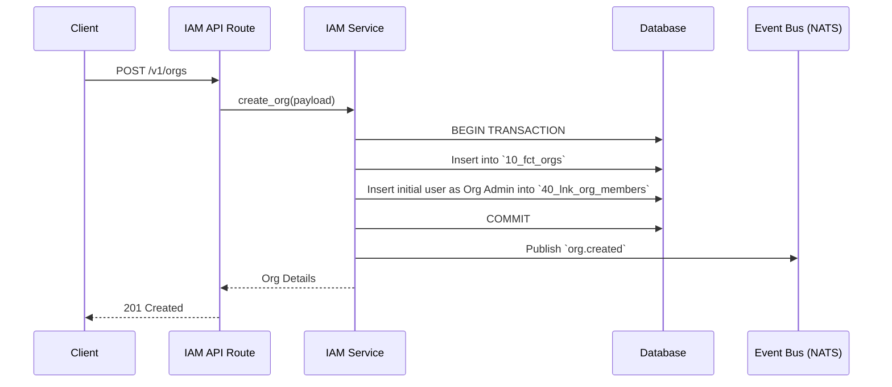

# IAM Workflows

## Authentication Flow

```mermaid
sequenceDiagram
    participant C as Client
    participant A as IAM API Route
    participant S as IAM Service
    participant D as Database (02_iam)

    C->>A: POST /v1/auth/login
    A->>S: authenticate_user(credentials)
    S->>D: Fetch user & password hash
    D-->>S: User Record
    S->>S: Verify Hash
    S->>D: Insert generic session or issue JWT token
    S-->>A: Auth Token
    A-->>C: 200 OK w/ Token
```

## Organisation Creation

```mermaid
sequenceDiagram
    participant C as Client
    participant A as IAM API Route
    participant S as IAM Service
    participant D as Database
    participant E as Event Bus (NATS)

    C->>A: POST /v1/orgs
    A->>S: create_org(payload)
    S->>D: BEGIN TRANSACTION
    S->>D: Insert into `10_fct_orgs`
    S->>D: Insert initial user as Org Admin into `40_lnk_org_members`
    S->>D: COMMIT
    S->>E: Publish `org.created`
    S-->>A: Org Details
    A-->>C: 201 Created
```
