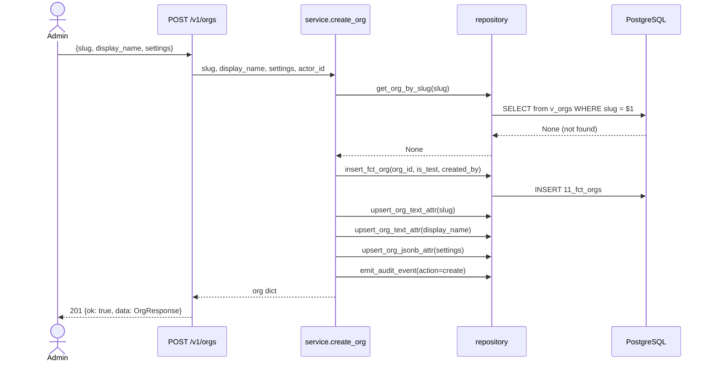
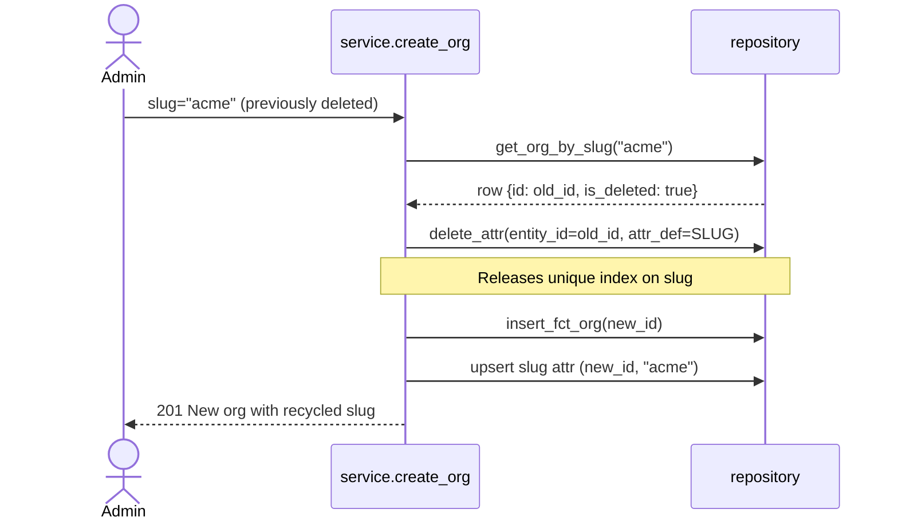
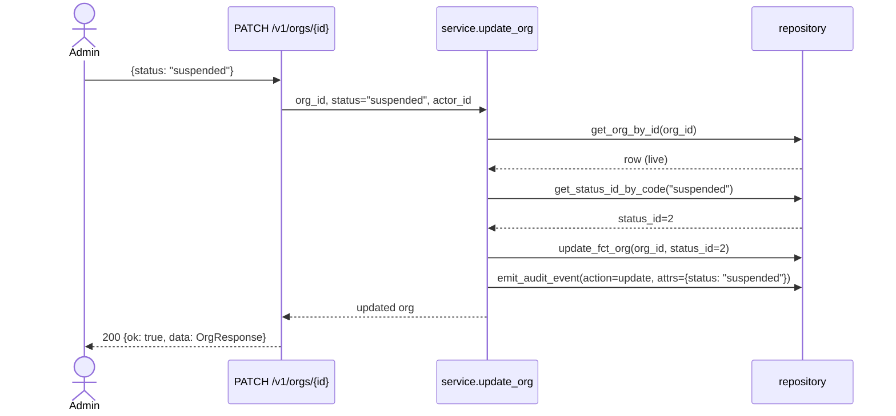
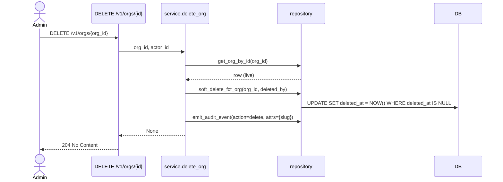

# Org — User Flows

## Flow 1: Create Organisation

```mermaid
sequenceDiagram
    actor Admin
    participant API as POST /v1/orgs
    participant Svc as service.create_org
    participant Repo as repository
    participant DB as PostgreSQL

    Admin->>API: {slug, display_name, settings}
    API->>Svc: slug, display_name, settings, actor_id
    Svc->>Repo: get_org_by_slug(slug)
    Repo->>DB: SELECT from v_orgs WHERE slug = $1
    DB-->>Repo: None (not found)
    Repo-->>Svc: None
    Svc->>Repo: insert_fct_org(org_id, is_test, created_by)
    Repo->>DB: INSERT 11_fct_orgs
    Svc->>Repo: upsert_org_text_attr(slug)
    Svc->>Repo: upsert_org_text_attr(display_name)
    Svc->>Repo: upsert_org_jsonb_attr(settings)
    Svc->>Repo: emit_audit_event(action=create)
    Svc-->>API: org dict
    API-->>Admin: 201 {ok: true, data: OrgResponse}
```

## Flow 2: Slug Re-use After Deletion

```mermaid
sequenceDiagram
    actor Admin
    participant Svc as service.create_org
    participant Repo as repository

    Admin->>Svc: slug="acme" (previously deleted)
    Svc->>Repo: get_org_by_slug("acme")
    Repo-->>Svc: row {id: old_id, is_deleted: true}
    Svc->>Repo: delete_attr(entity_id=old_id, attr_def=SLUG)
    Note over Svc,Repo: Releases unique index on slug
    Svc->>Repo: insert_fct_org(new_id)
    Svc->>Repo: upsert slug attr (new_id, "acme")
    Svc-->>Admin: 201 New org with recycled slug
```

## Flow 3: Suspend an Org

```mermaid
sequenceDiagram
    actor Admin
    participant API as PATCH /v1/orgs/{id}
    participant Svc as service.update_org
    participant Repo as repository

    Admin->>API: {status: "suspended"}
    API->>Svc: org_id, status="suspended", actor_id
    Svc->>Repo: get_org_by_id(org_id)
    Repo-->>Svc: row (live)
    Svc->>Repo: get_status_id_by_code("suspended")
    Repo-->>Svc: status_id=2
    Svc->>Repo: update_fct_org(org_id, status_id=2)
    Svc->>Repo: emit_audit_event(action=update, attrs={status: "suspended"})
    Svc-->>API: updated org
    API-->>Admin: 200 {ok: true, data: OrgResponse}
```

## Flow 4: Soft-Delete an Org

```mermaid
sequenceDiagram
    actor Admin
    participant API as DELETE /v1/orgs/{id}
    participant Svc as service.delete_org
    participant Repo as repository

    Admin->>API: DELETE /v1/orgs/{org_id}
    API->>Svc: org_id, actor_id
    Svc->>Repo: get_org_by_id(org_id)
    Repo-->>Svc: row (live)
    Svc->>Repo: soft_delete_fct_org(org_id, deleted_by)
    Repo->>DB: UPDATE SET deleted_at = NOW() WHERE deleted_at IS NULL
    Svc->>Repo: emit_audit_event(action=delete, attrs={slug})
    Svc-->>API: None
    API-->>Admin: 204 No Content
```
