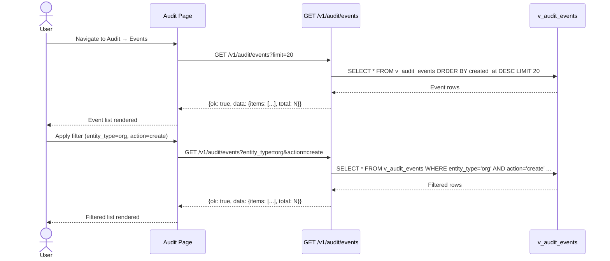
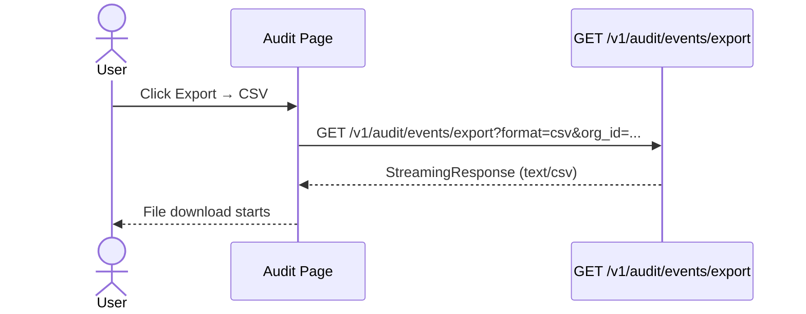
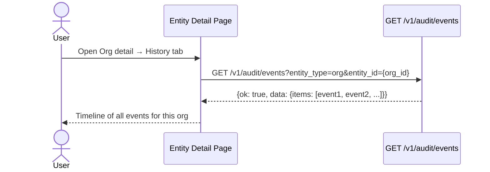

# 01_log — User Flows

## Flow 1: Browse and Filter Audit Events

```mermaid
sequenceDiagram
    actor User
    participant UI as Audit Page
    participant API as GET /v1/audit/events
    participant DB as v_audit_events

    User->>UI: Navigate to Audit → Events
    UI->>API: GET /v1/audit/events?limit=20
    API->>DB: SELECT * FROM v_audit_events ORDER BY created_at DESC LIMIT 20
    DB-->>API: Event rows
    API-->>UI: {ok: true, data: {items: [...], total: N}}
    UI-->>User: Event list rendered

    User->>UI: Apply filter (entity_type=org, action=create)
    UI->>API: GET /v1/audit/events?entity_type=org&action=create
    API->>DB: SELECT * FROM v_audit_events WHERE entity_type='org' AND action='create' ...
    DB-->>API: Filtered rows
    API-->>UI: {ok: true, data: {items: [...], total: N}}
    UI-->>User: Filtered list rendered
```

## Flow 2: Export Audit Events

```mermaid
sequenceDiagram
    actor User
    participant UI as Audit Page
    participant API as GET /v1/audit/events/export

    User->>UI: Click Export → CSV
    UI->>API: GET /v1/audit/events/export?format=csv&org_id=...
    API-->>UI: StreamingResponse (text/csv)
    UI-->>User: File download starts
```

## Flow 3: View Entity History

```mermaid
sequenceDiagram
    actor User
    participant UI as Entity Detail Page
    participant API as GET /v1/audit/events

    User->>UI: Open Org detail → History tab
    UI->>API: GET /v1/audit/events?entity_type=org&entity_id={org_id}
    API-->>UI: {ok: true, data: {items: [event1, event2, ...]}}
    UI-->>User: Timeline of all events for this org
```
